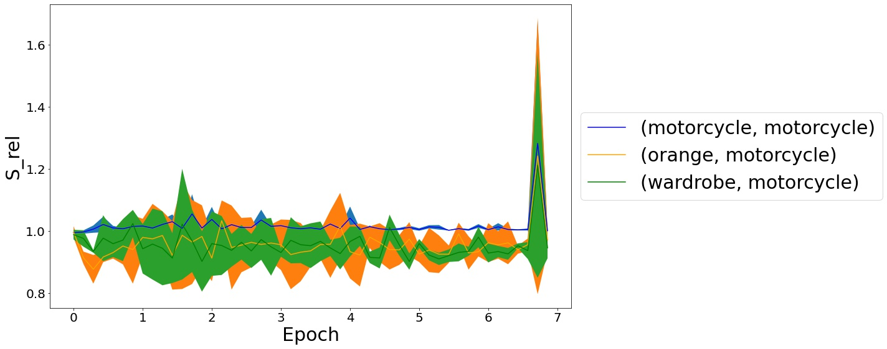
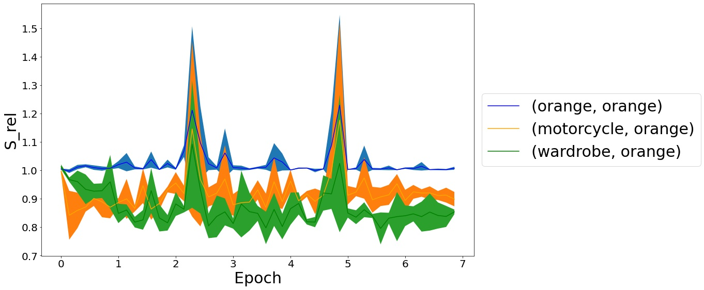
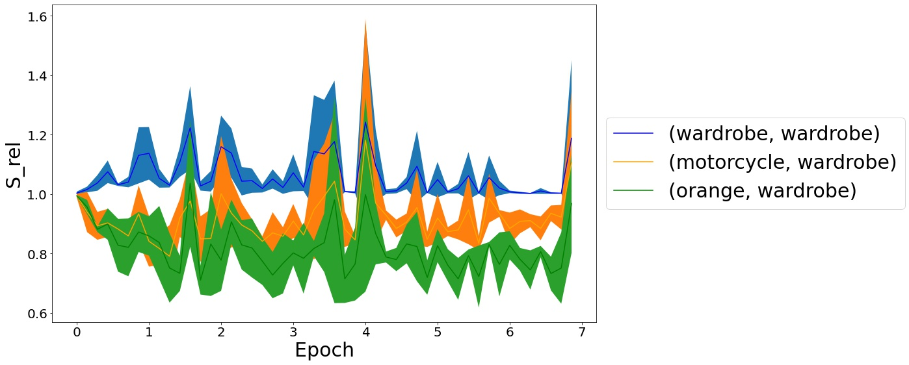

# Dynamics of Local Elasticity During Training of Neural Nets 

In the recent past a certain property of neural training trajectories in weight-space had been isolated, that of "local elasticity" ( $S_{\rm rel}$ ) - which attempts to quantify the propagation of influence of a sampled data point on the prediction at another data point. In this work, we embark on a comprehensive study of local elasticity. Firstly, specific to the classification setting, we suggest a new definition of the original idea of $S_{\rm rel}$. Via experiments on state-of-the-art neural networks training on SVHN, CIFAR-10 and CIFAR-100 we demonstrate how our new $S_{\rm rel}$ detects the property of the weight updates preferring to make changes in predictions within the same class as of the sampled data. Next, we demonstrate via examples of neural regression that the original $S_{\rm rel}$ reveals a $2-$ phase behavior: that their training proceeds via an initial elastic phase when $S_{\rm rel}$ changes rapidly and an eventual inelastic phase when $S_{\rm rel}$ remains large.  Lastly, we give multiple examples of learning via gradient flows for which one can get a closed-form expression of the original $S_{\rm rel}$ function. By studying the plots of these derived formulas we give theoretical demonstrations of some of the experimentally detected properties of $S_{\rm rel}$ in the regression setting.

Link to our paper can be found [here](https://arxiv.org/pdf/2111.01166.pdf)

## A Summary of Our Theoretical Results About $S_{\rm rel}$

|                    **Model**                    |        **Result**       |  **Hypothesis That it Corroborates**  |    **Example of Exact $S_{\rm rel}$**    |
|:-----------------------------------------------:|:-----------------------:|:-------------------------------------:|:----------------------------------------:|
|            Classification by features           |       Theorem 3.2       |           Hypothesis 1.2 (b)          |                Theorem 3.2               |
|                A single ReLU gate               |        Lemma 4.3        |           Hypothesis 1.2 (b)          | (implicitly contained in the discussion) |
| Weight d-homogeneous,<br /> feature linear predictors | Theorem 5.1 <br />Theorem 5.3 | Hypothesis 1.1 (b) <br />Hypothesis 1.2 (b) |                Theorem 5.2               |


## Experimental study of the time dynamics of $S_{\rm rel}$

We trained a RESNET-18 on SVHN, CIFAR-10 and CIFAR-100 to track the dynamics of $S_{\rm rel}$. The following are the results for CIFAR-100 which clearly shows that our definition outperforms the original definition of $S_{\rm rel}$

 
 
 

The images at the left are for our definition of $S_{\rm rel}$ while the ones on the right are for te original definition. 

## Directory Structure

- <b> Assets: </b> Contains all pickle files for the python lists used to store all the accuracy metrics, loss and $S_{\rm rel}$ throughout training. Users would only need to load the appropriate pickle files using the following code to reproduce the plots without training:

```python

with open(path+'pair_iters_cifar_100_kl.pkl','rb') as f:
    pair_iters=pickle.load(f)

```
where `path` would be a string defining the directory to access the `Assets` folder

- <b> Plots: </b> Contains all the relevant plots that have been used in the paper. The directory contains subdirectories corresponding to each dataset which contain further subdirectories corresponding to the two definitions of $S_{\rm rel}$.

- <b> Scripts: </b> Contains all the `.ipynb` files which were used to conduct the experiments on the datasets and generate the plots. Users need to make sure that the script named `utils.py` is in the same directory as the scripts.

## Authors

- [Anirbit Mukherjee](https://research.manchester.ac.uk/en/persons/anirbit.mukherjee)
- [Soham Dan](https://sdan2.github.io)
- [Avirup Das](https://github.com/avirupdas55)
- [Phanideep Gampa](https://phanideepgampa.github.io)


